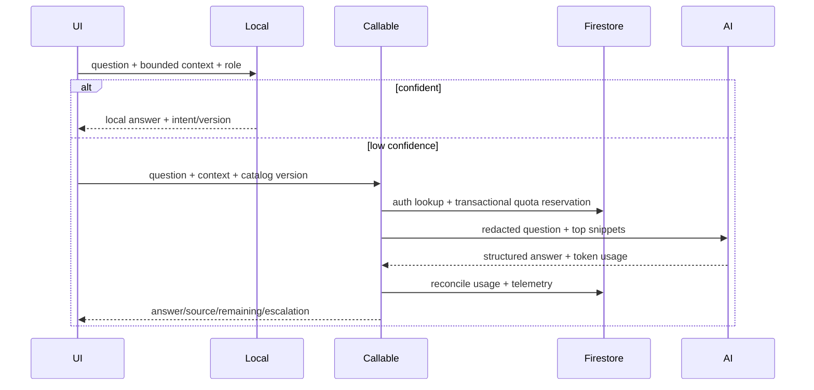

# Design: Hybrid Virtual Assistant

## Technical Approach

Use the audited product inventory as the input to one typed, versioned catalog. A build step emits identical JSON plus checksum for the SPA and Functions. The browser performs deterministic, token-free resolution first; only low-confidence questions call an authenticated 2nd-gen Firebase callable. The server derives identity/tenant/role, retrieves catalog snippets, reserves quota atomically, invokes the model, records actual tokens, and returns a typed, attributable answer.

## Architecture Decisions

| Topic | Options / tradeoff | Decision and rationale |
|---|---|---|
| Canonical knowledge | Duplicate client/server manuals are simple but drift; Firestore requires network | `shared/soporte/catalogo.v1.ts` using `satisfies CatalogoSoporte`; generate client/function JSON and fail CI on checksum/schema drift. Entries include stable intent, module, aliases/actions, roles, steps, route, sensitivity, escalation, status and `catalogVersion`. |
| Inventory | Manual prose is compact but unverifiable | Use `inventario-funciones.md` as the reviewed baseline. Every row maps to one or more catalog intents and records its code source and authorization gap. |
| Local engine/context | Substring matching is cheap but ambiguous; embeddings add cost/operations | Normalize tokens, exact phrase/action boosts, negative terms, role filtering and thresholds: `>=0.78` answer, `0.55-0.77` clarify, `<0.55` fallback. Score the current question first; use at most four prior redacted turns only for pronouns/module continuity. |
| Secure AI boundary | Browser SDK is easy but exposes keys and quotas | `onCall` 2nd gen with Auth and `enforceAppCheck`; tenant/role come from trusted user data/claims. Secret Manager holds provider credentials. Limit input to 1,200 and output to 300 tokens; send only top catalog snippets. |
| Quota/budget | Fixed call counts are simple but ignore token price; pure cost limits can starve tenants | Firestore transaction reserves estimated micros across global, tenant and user monthly documents, then reconciles actual tokens. Initial pilot uses Gemini 2.5 Flash-Lite pricing ($0.10/M input, $0.40/M output): about $0.00024/call, rounded to $0.001 with 4x safety. From a $10 monthly budget, expose $8/8,000 calls and retain 20% for variance/infrastructure. Tenant caps: Starter 200, Growth 600, Pro 2,000/month; user caps: 50/150/500 monthly and 10/25/50 daily. Local answers remain unlimited. Low caps reveal catalog gaps; the global ceiling may reject valid traffic, so tune monthly from measured fallback rate and actual tokens. |
| Escalation/roles | Direct Firestore/complete transcripts leak data | Callable creates a redacted ticket from Auth identity and returns a `wa.me` link containing only ticket ID and short category. Master updates require a custom claim. Roles are versioned capabilities: current `Admin|Editor|Asistente|Tutor|SuperAdmin`, reserved `Estudiante`; hidden future entries cannot match until enabled. |
| Telemetry | Full prompts aid debugging but retain PII | Log hashed uid/tenant, intent, scores, source, latency, tokens, estimated/actual cost, quota outcome and escalation reason; never raw prompt/transcript. Alerts at 50/75/90/100% global budget. |

## Data Flow

## File Changes

| File(s) | Action | Purpose |
|---|---|---|
| `shared/soporte/catalogo.v1.ts`, build script, generated assets | Create | Canonical typed catalog and reproducible runtime copies |
| `servicios/soporte/{matcher,cliente,contexto}.ts`, `tipos.ts` | Create/modify | Local resolver and shared contracts |
| `components/AsistenteVirtual.tsx` | Modify | Source labels, clarification, quota and ticket/WhatsApp UX |
| `functions/asistente/*`, `functions/index.js`, `functions/package.json` | Create/modify | Auth/App Check, model, quota, ticket and telemetry boundary |
| `firestore.rules`, `firestore.indexes.json`, `firebase.json`, `vite.config.ts` | Create/modify | Deny client quota/ticket mutation, deploy rules, remove frontend AI key |

## Interfaces / Contracts

`AssistantResult = {answer, source:'local'|'ai'|'human', intentId?, catalogVersion, confidence, remaining:{user,tenant,global}, escalation?:{ticketId,whatsappUrl}}`.

## Testing Strategy

| Layer | Approach |
|---|---|
| Unit | Table/golden tests for every inventory intent, role, threshold, context and redaction; mock model/token usage and clocks. |
| Integration | Emulator tests for Auth/App Check, claims, quota races/reconciliation, rules, ticket minimization and global stop. |
| E2E | Local answer, clarify, AI, exhausted quota, ticket and WhatsApp; stabilize the existing timeout first. |

## Migration / Rollout

Rotate every exposed provider credential first; purge frontend injection and migrate legacy runtime config to Secret Manager. Ship catalog-only behind `assistantCatalogV1`, then shadow fallback telemetry, enable AI for internal/Master users, 10% tenants, one plan at a time. Disable AI/WhatsApp independently; local catalog and authorized tickets remain available.

## Open Questions

None blocking; budget, model and plan multipliers are deploy-time parameters reviewed after the first 30 days.
