# Design: Marcadores vivos del catálogo de soporte

## Technical Approach

Tres piezas nuevas sobre infraestructura existente, sin dependencias nuevas:

1. Un tipo derivado `MarcadorSoporte` en `shared/soporte/tipos.ts` y un export `soporteMeta` co-locado en la vista (capa de tipado).
2. Un módulo compartido `scripts/lib/catalogo-fuente.mjs` que lee el núcleo manual, escanea marcadores por AST y fusiona. Lo consumen **ambos** ejecutables (`generar-catalogo.mjs` y el gate nuevo), de modo que generador y gate nunca puedan ver catálogos distintos — una fuente de deriva sería el propio remedio.
3. Un gate `scripts/verificar-rutas-soporte.mjs` que compara los archivos que `App.tsx` monta contra la cobertura del catálogo fusionado.

Principio rector del gate: **es una función pura de (árbol del repo, lista de archivos cambiados, baseline del commit base)**. Todo el plumbing de git vive en el workflow, no en el script. Eso lo hace determinista y testeable con fixtures sin repositorio git.

## Architecture Decisions

| # | Tema | Opciones y tradeoff | Decisión y rationale |
|---|---|---|---|
| D1 | Forma de `soporteMeta` | Objeto único (no sirve: `AgendaView` necesita 3 entradas); unión `Entrada \| Entrada[]` (dos caminos de parseo, dos matrices de test, y una vista que crece de 1 a 2 entradas cambia de forma en el diff); array siempre | **Array siempre**: `export const soporteMeta: MarcadorSoporte[]`. Un solo camino de parseo (`ArrayLiteralExpression`), un solo modelo mental ("una vista declara sus entradas"), y agregar una entrada es un append, no un refactor. Costo: dos corchetes en el caso 1:1. |
| D2 | Tipo del marcador | `EntradaCatalogoSoporte` completo; `Omit` de los campos "sello" | **`export type MarcadorSoporte = Omit<EntradaCatalogoSoporte, 'introducedIn'>`**. `validacion.ts:71` exige `entry.introducedIn === catalog.catalogVersion`; hardcodearlo en N vistas convierte cada bump de versión en una edición de N archivos, es decir, fabrica exactamente la deriva que este change cura. El generador lo estampa desde el núcleo. `owner` y `lastVerifiedAt` **sí** quedan en el marcador: obligar a escribir la fecha de última verificación al lado de la UI es señal de revisión, no boilerplate. La entrada **emitida** satisface el contrato completo. |
| D3 | Valor estático | Permitir constantes importadas/spreads/helpers (`entry(...)`); exigir literal auto-contenido | **Literal estático auto-contenido**. El evaluador AST solo acepta string/number/boolean/null, array y objeto literal (desenvolviendo `as`/`satisfies`/paréntesis). Identificador, spread, llamada, template con sustitución o clave computada ⇒ **falla dura** con `archivo:línea:columna` y `SyntaxKind`. Rationale: garantiza derivabilidad sin ejecutar el módulo y hace el modo de falla explícito en vez de perder campos en silencio. |
| D4 | Ubicación de la baseline de deuda | Constante en el script (dato mezclado con código, ilegible en el diff); co-locada en `catalogo.v1.ts` (contamina la fuente del artefacto publicado, riesgo de filtrarse al JSON); JSON aparte; TS aparte (requiere transpilar) | **`shared/soporte/deuda-catalogo.json`**. El gate es Node ESM plano: JSON se lee sin transpilar y sin importar código de app. Es además el archivo cuyo *diff* se inspecciona: un array de strings ordenado da el diff más limpio y la comparación base-vs-head más simple. |
| D5 | Dos listas, una regla | Una sola lista de deuda (obliga a meter `App.tsx` —montado vía `RutaInicial`— en una lista que debe llegar a cero); lista de exentos libre (escotilla que anula el gate) | **Dos arrays, `deuda` y `exentosPermanentes`, con la misma regla shrink-only.** `exentosPermanentes` cubre el núcleo transversal declarado fuera de alcance (`App.tsx`/`shell.session`). Difieren solo en reporte: tocar deuda emite aviso de migración; tocar un exento, no. |
| D6 | Enforcement "solo puede achicarse" | Snapshot committeado aparte (auto-referencial: se edita igual); tope numérico en el script (no detecta swap A→B); comparación contra el commit base | **`git show <base>:shared/soporte/deuda-catalogo.json`**, materializado por el workflow y pasado al gate con `--baseline-base`. `añadidos = actual \ base` sobre `deuda ∪ exentosPermanentes`; si no está vacío, falla nombrando cada agregado. Si el archivo no existe en base (PR que lo introduce) ⇒ bootstrap, se salta con aviso. |
| D7 | Aviso no bloqueante | Comentario en el PR vía `gh`/API (necesita token con write, no funciona en forks); anotación de Actions | **`::notice file={path},line=1::…` en stdout + bloque en `$GITHUB_STEP_SUMMARY`.** Cero permisos, aparece en la pestaña Files del PR y en la página del run. Solo `::error` + exit≠0 rompe el job, así que la no-bloqueo es estructural. Fuera de CI (`GITHUB_ACTIONS` ausente) imprime texto plano. |
| D8 | `catalog.routes` con marcadores | Unir automáticamente las `route` de los marcadores; mantener `RUTAS_SOPORTE_CONOCIDAS` como única fuente | **Mantener manual.** Si la fusión auto-agrega rutas, un typo en un marcador se auto-declara "conocido" y `validacion.ts:58` deja de verificar nada. `/jornadas` se agrega a mano a `RUTAS_SOPORTE_CONOCIDAS`. Costo aceptado: alta de ruta nueva toca dos archivos, con mensaje de error que dice exactamente qué agregar. |
| D9 | Anti-huérfano | Confiar en el gate de rutas | El generador **exige que el propio archivo del marcador esté en su `sourceFiles`** (falla dura si no), y el gate verifica `existsSync` de **cada** `sourceFiles` de **cada** entrada (manual y marcador). Esto cierra de raíz la clase `vistas/Horarios.tsx` — que el gate de rutas por sí solo no detecta, porque una entrada huérfana no es una ruta descubierta. |
| D10 | Inyección para tests | Leer siempre desde `process.cwd()` | Flags nuevos `--source-root` (generador y gate) y `--changed-files` / `--baseline-base` (gate). Sin ellos las colisiones de id, el crecimiento de la baseline y el aviso de diff son intesteables. |

## Interfaces / Contracts

```ts
// shared/soporte/tipos.ts
export type MarcadorSoporte = Omit<EntradaCatalogoSoporte, 'introducedIn'>;
```

Ubicación **uniforme**: primera declaración top-level después del bloque de imports, antes de cualquier otra constante o componente. Uniforme = greppable, diff estable, y coincide con la restricción "solo statements top-level" del escáner.

| Archivo | Línea aprox. de inserción | Contenido |
|---|---|---|
| `vistas/BuzonNotificaciones.tsx` | tras `import MediosPagoResumen` (l.16), antes de `const VistaBuzonNotificaciones` (l.18) | 1 entrada: `buzon.consultor` |
| `vistas/admin/AgendaView.tsx` | tras `import ModalEdicionJornada` (l.29), antes de `ROLES_CON_ACCESO_AGENDA` (l.63) | 3 entradas: `agenda.read` + `agenda.manage` (route `/`) y `agenda.standalone` (route `/agenda`) |
| `vistas/admin/JornadasView.tsx` | tras `import PestanaProgramaJornada` (l.35) | 1 entrada nueva: `jornadas.manage`, route `/jornadas`, roles `['Admin','Editor']` |

```ts
export const soporteMeta: MarcadorSoporte[] = [
  { id: 'agenda.read', inventoryId: 'agenda.read', module: 'agenda', /* … */
    route: '/', sourceFiles: ['vistas/admin/AgendaView.tsx'], status: 'active' },
  // … agenda.manage, agenda.standalone
];
```

### CLI

| Ejecutable | Flags |
|---|---|
| `scripts/generar-catalogo.mjs` | `--check`, `--output-root <dir>` (existentes), **`--source-root <dir>`** (nuevo, default `cwd`) |
| `scripts/verificar-rutas-soporte.mjs` | `--source-root <dir>`, `--changed-files <path>`, `--baseline-base <path>`, `--strict-baseline` |

## Data Flow

### Escaneo de marcadores (`escanearMarcadores({ root, dirs })`)

Recorre `vistas/` y `components/` con `readdirSync(dir, { withFileTypes: true })` recursivo; salta `node_modules`, `.claude`, `__mocks__`, `__fixtures__` y `*.test.*`/`*.spec.*`. **Pre-filtro barato**: si el texto no contiene la subcadena `soporteMeta`, no se parsea (mantiene el costo del escaneo en el orden de un `grep`). Para el resto: `ts.createSourceFile(file, texto, ts.ScriptTarget.ES2022, false, ts.ScriptKind.TSX)`, se itera **solo `sourceFile.statements`** buscando un `VariableStatement` con `ModifierFlags.Export` cuyo declarador se llame `soporteMeta`, y se evalúa su `initializer` con el evaluador estático de D3. **Nunca** `transpileModule` + `import` para vistas: eso es lo que rompe por JSX y globals de navegador.

Orden determinista (el checksum está committeado): archivos ordenados por ruta relativa POSIX con comparación byte a byte (no `localeCompare`, que depende de locale), y dentro de un archivo, el orden de declaración del array.

### Escaneo de `App.tsx` (`leerRutasApp({ root })`)

Dos pasadas sobre el mismo `SourceFile`:

1. **Mapa de imports**: cada `ImportDeclaration` con specifier relativo → resuelve probando `.tsx`, `.ts`, `/index.tsx`, `/index.ts` con `existsSync`; registra el nombre default, los named y el namespace → ruta relativa POSIX. Todo identificador de componente **no** importado (`RutaInicial`, `AppLayout`) mapea a `App.tsx`.
2. **Recorrido de rutas**: `ts.forEachChild` recursivo; para cada `JsxSelfClosingElement`/`JsxOpeningElement` cuyo tag termine en `Route`:
   - atributo `path`: solo `ts.isStringLiteral` ⇒ literal. Ausente (route de layout, l.634) ⇒ se salta. `"*"` ⇒ se salta explícitamente.
   - atributo `element`: se recolectan **todos** los tags JSX del subárbol de la expresión — indispensable porque `/jornadas`, `/agenda`, `/configuracion`, `/aliant-control` y `/login` usan ternarios. Se excluyen los tags de `react-router-dom` (`Navigate`, `Outlet`, `Routes`, `Route`), identificados por el mapa de imports.
   - Salida: pares `{ route, file }`. La relación es N:M real (`FirmaImagen.tsx` en 2 rutas, `ClaseEnVivoView` en 2, `/` en 2 archivos).

### Fusión (`fusionarCatalogo`)

```
entries = [...núcleo.entries,
           ...marcadores ordenados por archivo, luego por índice]
         .map(e => ({ ...e, introducedIn: núcleo.catalogVersion }))
routes  = [...RUTAS_SOPORTE_CONOCIDAS]        // sin unión automática (D8)
```

Núcleo primero **en su orden de declaración actual** para minimizar el diff del JSON emitido; marcadores después, en orden derivado del path. Colisiones (`id` o `inventoryId`, marcador↔manual y marcador↔marcador) se **acumulan todas** y se reportan juntas con archivo(s) e id antes de salir con código 1 — un CI que revela un error por corrida es un CI que se corre cinco veces.

**Los tests existentes no dependen del orden**: `catalogo.v1.test.ts:67` compara `.sort()`, y `:70` solo cuenta. El único acoplamiento al orden es el checksum, que la regla determinista resuelve.

## Testing Strategy

`strict_tdd: true` — test primero en cada tarea.

| Capa | Qué | Cómo |
|---|---|---|
| Unit (`node --test`, `npm run test:node`) | Evaluador AST, escaneo de marcadores, lectura de rutas, fusión, colisiones, baseline shrink-only, aviso de diff | Nuevos `scripts/catalogo-marcadores.test.js`, `scripts/rutas-app.test.js`, `scripts/verificar-rutas-soporte.test.js`, importando `scripts/lib/catalogo-fuente.mjs` como ESM nativo (patrón ya vigente: `verificar-bundle-seguro.test.js`, `normalizar-correos.test.js`) |
| Integración (jest) | Generador end-to-end y `--check` | `scripts/validar-catalogo.test.ts`, ampliando el patrón `spawnSync` existente |
| Contrato (tsc) | Rol/sensibilidad/campo inválido en un marcador | `npx tsc --noEmit` sobre las 3 vistas reales |
| Regresión (jest) | Sin cambio de resolución tras la fusión | `servicios/soporte/matcher.test.ts`, `contexto.test.ts`, suites de las 3 vistas |

### Estrategia de mocking/fixtures

**No se mockea `fs` ni `ts`.** La unidad bajo prueba *es* un lector de filesystem + AST; mockear `fs` testearía el mock. Se usa **inyección del root** (`--source-root` / parámetro `root`) sobre **fixtures reales en disco** bajo `scripts/__fixtures__/catalogo-gate/`, un subdirectorio por escenario para que cada test tenga un árbol aislado. Parsear un `.tsx` de 20 líneas cuesta microsegundos.

| Fixture | Escenario que cubre |
|---|---|
| `marcador-simple/` | 1 entrada, caso 1:1 |
| `marcador-multiple/` | 3 entradas, 2 rutas (análogo de `AgendaView`) |
| `marcador-duplicado/` | dos archivos con el mismo `id` ⇒ falla dura |
| `marcador-dinamico/` | `soporteMeta` con spread / constante importada ⇒ falla dura con `archivo:línea:columna` |
| `marcador-jsx-pesado/` | JSX + `window.matchMedia` en el top level ⇒ prueba que se lee sin ejecutar |
| `marcador-sin-selfref/` | `sourceFiles` que no incluye el propio archivo ⇒ falla dura (D9) |
| `app-rutas/App.tsx` | paths literales, `*`, route de layout sin `path`, `element` con ternario, dos rutas al mismo archivo, componente declarado localmente |
| `baseline-crece/` | `deuda-catalogo.json` base vs head con un elemento agregado |

**Requisito de configuración**: agregar `"scripts/__fixtures__"` a `exclude` de `tsconfig.json` — `include` es `**/*.ts(x)`, así que sin eso los fixtures deliberadamente inválidos romperían `npm run typecheck`. Jest no los levanta (no matchean `*.test.tsx`).

### Impacto exacto en tests existentes

| Archivo | Cambio |
|---|---|
| `shared/soporte/catalogo.v1.test.ts` | Sacar `agenda.read`, `agenda.manage`, `agenda.standalone`, `buzon.consultor` de `INVENTARIO_ESPERADO`; `toHaveLength(59)` → `toHaveLength(55)`. Sigue testeando **el núcleo manual**, no el fusionado. |
| `scripts/validar-catalogo.test.ts` | l.18 `toHaveLength(59)` → `55`. l.68-74: `expectedJson = serializarCatalogoSoporte(CATALOGO_SOPORTE_V1)` deja de valer (el generado ahora es fusionado). Se reemplaza por invariantes sobre el artefacto: copia `public/` ≡ copia `functions/` byte a byte, `.sha256` ≡ `sha256(json)`, y `validarCatalogoSoporte(JSON.parse(json)) === []`. Rationale: mantiene el test significativo sin duplicar la lógica de fusión dentro del test. Se agregan casos de id duplicado y marcador dinámico vía `--source-root` sobre fixtures. |
| Golden fusionado (nuevo) | `scripts/catalogo-fusion.test.js` (node --test) arma el catálogo fusionado real contra la raíz del repo y afirma los 60 `inventoryId` esperados (55 manuales + 4 migrados + `jornadas.manage`). **Rechazado**: hacerlo en jest importando `soporteMeta` desde `AgendaView` — arrastra el grafo de dependencias de React a un test de datos. |
| Gate (nuevo) | `scripts/verificar-rutas-soporte.test.js`: archivo enrutado fuera de baseline sin marcador ⇒ exit 1 nombrando ruta y archivo; marcador con `route` inexistente en `App.tsx` ⇒ exit 1; cobertura sin ningún rol `active` ⇒ exit 1; archivo de deuda no tocado ⇒ exit 0 sin aviso; tocado ⇒ exit 0 + `::notice`; baseline crecida ⇒ exit 1; árbol íntegro ⇒ exit 0. |
| `App.routing.test.ts`, `matcher.test.ts`, `contexto.test.ts` | Sin cambios; corren como regresión. |

## File Changes

| Archivo | Acción | Descripción |
|---|---|---|
| `shared/soporte/tipos.ts` | Modify | `MarcadorSoporte` (D2) |
| `shared/soporte/catalogo.v1.ts` | Modify | Salen 4 entradas (3 agenda + buzón); entra `/jornadas` en `RUTAS_SOPORTE_CONOCIDAS` |
| `shared/soporte/deuda-catalogo.json` | Create | `{ note, deuda[], exentosPermanentes[] }`, arrays ordenados |
| `scripts/lib/catalogo-fuente.mjs` | Create | `leerNucleoManual`, `escanearMarcadores`, `leerRutasApp`, `fusionarCatalogo` |
| `scripts/generar-catalogo.mjs` | Modify | Delega en el lib, agrega `--source-root`, quita el `entries.length !== 59` fijo de `assertCatalog` |
| `scripts/verificar-rutas-soporte.mjs` | Create | Gate de rutas, baseline y avisos |
| `vistas/BuzonNotificaciones.tsx`, `vistas/admin/AgendaView.tsx`, `vistas/admin/JornadasView.tsx` | Modify | `soporteMeta` |
| `.github/workflows/deploy.yml` | Modify | `fetch-depth: 0`, paso de resolución de base, gate y `--check` sobre la raíz |
| `tsconfig.json` | Modify | `exclude: scripts/__fixtures__` |
| `docs/asistente/catalogo.md` | Modify | Checklist manual → mecanismo automático; corregir la línea 40 sobre `Estudiante` |
| `public/`, `functions/generated/soporte/*.json` + `.sha256` | Regenerate | Mismo esquema |
| `scripts/__fixtures__/catalogo-gate/**`, 4 archivos `*.test.js` | Create | Ver tabla de fixtures |

### Wiring en `.github/workflows/deploy.yml` (job `pruebas`)

`actions/checkout@v4` pasa a `fetch-depth: 0` (hoy es 1 y sin historia no hay `merge-base` ni `git show <base>:…`). Los pasos nuevos van **después de `Typecheck` y antes de `Pruebas de la app`**: son de segundos y deben fallar antes de los ~8 minutos de suites.

```yaml
- name: Base del diff para el catálogo de soporte
  run: |
    BASE="$(git merge-base origin/${GITHUB_BASE_REF:-main} HEAD || echo '')"
    git diff --name-only "$BASE" HEAD > /tmp/soporte-cambios.txt
    git show "$BASE:shared/soporte/deuda-catalogo.json" > /tmp/soporte-deuda-base.json || true
- name: Gate de rutas del catálogo de soporte
  run: node scripts/verificar-rutas-soporte.mjs
       --changed-files /tmp/soporte-cambios.txt
       --baseline-base /tmp/soporte-deuda-base.json --strict-baseline
- name: Catálogo generado en sincronía
  run: node scripts/generar-catalogo.mjs --check
```

## Sequence Diagram

```mermaid
sequenceDiagram
  autonumber
  participant Dev
  participant CI as job `pruebas`
  participant Lib as catalogo-fuente.mjs
  participant Gate as verificar-rutas-soporte.mjs
  participant Gen as generar-catalogo.mjs

  Dev->>CI: abre PR / push
  CI->>CI: checkout fetch-depth 0 · npm install · tsc --noEmit
  CI->>CI: git merge-base -> cambios.txt + deuda-base.json
  CI->>Gate: --changed-files --baseline-base --strict-baseline
  Gate->>Lib: leerNucleoManual() + escanearMarcadores(vistas/, components/)
  Lib-->>Gate: catálogo fusionado (falla dura si id duplicado / literal no estático / self-ref faltante)
  Gate->>Lib: leerRutasApp() -> pares {route, file}
  loop por archivo enrutado
    alt fuera de deuda y sin marcador
      Gate-->>CI: ::error ruta + archivo -> exit 1
    else marcador con route inexistente en App.tsx
      Gate-->>CI: ::error -> exit 1
    else sin ningún rol status active
      Gate-->>CI: ::error -> exit 1
    else en deuda y presente en cambios.txt
      Gate-->>CI: ::notice migrá este archivo (no bloquea)
    end
  end
  Gate->>Gate: (actual \ base) sobre deuda + exentos
  alt la lista creció
    Gate-->>CI: ::error solo puede achicarse -> exit 1
  end
  Gate-->>CI: exit 0 + $GITHUB_STEP_SUMMARY
  CI->>Gen: --check (sobre la raíz real)
  Gen->>Lib: mismo catálogo fusionado
  alt JSON/sha256 committeados desincronizados
    Gen-->>CI: Catalog drift detected -> exit 1
  else
    Gen-->>CI: exit 0
  end
  CI->>CI: test:app · test:functions:full · test:node · firestore-rules
```



## Migration / Rollout

Sin migración de datos. El artefacto publicado no cambia de forma, así que cliente y `functions/index.js` no se tocan. Rollout en el orden del diagrama de dependencias: tipo → lib + tests unitarios → generador → 3 marcadores → baseline → gate → workflow. El gate nace verde porque los 27 archivos enrutados no migrados entran en la baseline congelada. Rollback: ver `proposal.md` (tres capas independientes; los `soporteMeta` remanentes son inertes — datos puros sin imports, que Rollup elimina del bundle por tree-shaking).

## Open Questions

- [ ] **El número "56" del proposal y del spec no cierra con ninguna magnitud real.** Son tres cosas distintas: (a) entradas manuales restantes tras la PoC = **55**, no 56 — la PoC migra **4** entradas (`agenda.read`, `agenda.manage`, `agenda.standalone`, `buzon.consultor`), no 3; el proposal confundió "3 vistas" con "3 entradas"; (b) archivos enrutados en la baseline de deuda = **~27** (30 archivos enrutados distintos menos las 3 vistas de la PoC), de los cuales `App.tsx` va a `exentosPermanentes`; (c) el catálogo fusionado queda en **60** entradas, no 59+1. El spec `catalogo-soporte-antideriva` fija "56 rutas/archivos" como condición de archivado del change de seguimiento. **Se necesita decisión**: reconciliar el spec a "las N entradas manuales restantes" (contadas en implementación) o a "los N archivos enrutados en deuda". No lo resuelvo por criterio técnico porque es una condición de aceptación explícita del usuario.
- [ ] **D2 refina la letra del spec.** `catalogo-soporte-antideriva` l.11 enumera `introducedIn` entre los campos que el marcador declara. Con D2 lo estampa el generador. La **entrada emitida** sigue satisfaciendo el contrato íntegro; hace falta un ajuste de una línea en el spec ("la entrada emitida satisface…") durante `sdd-apply`.
- [ ] `RutaInicial` monta `VistaAdministracion` sin ser una `<Route>` propia, así que `vistas/Administracion.tsx` (y las 8 entradas que lo referencian) **no** entran al gate. Coherente con el Out of Scope "elementos no enrutados", pero conviene dejarlo escrito en `docs/asistente/catalogo.md` para que nadie asuma cobertura que no existe.
